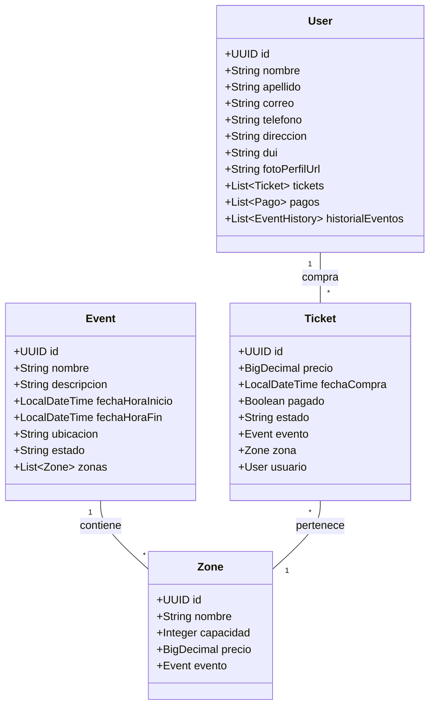
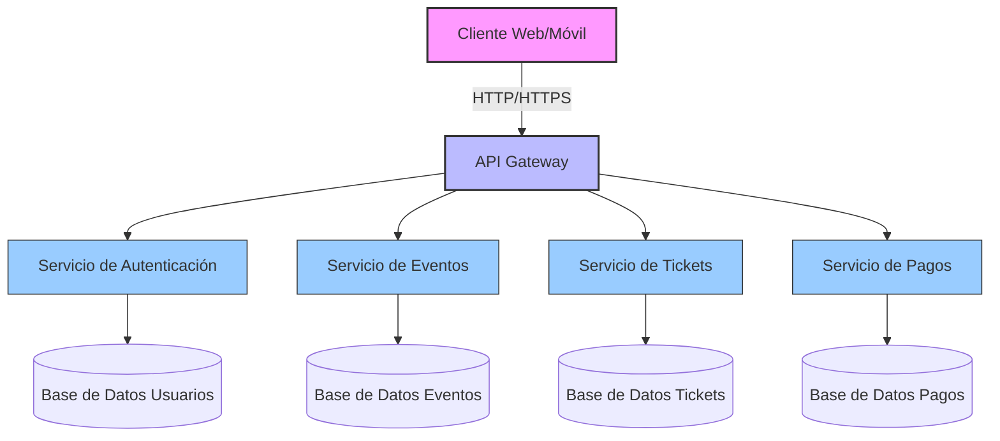

# 🎟️ Rave-Tix - Sistema de Gestión de Eventos y Venta de Entradas


## 📋 Tabla de Contenidos
- [Descripción](#-descripción)
- [Características Principales](#-características-principales)
- [Tecnologías Utilizadas](#-tecnologías-utilizadas)
- [Estructura del Proyecto](#-estructura-del-proyecto)
- [Documentación de la API](#-documentación-de-la-api)
- [Instalación](#-instalación)
- [Despliegue](#-despliegue)
- [Licencia](#-licencia)
- [Contacto](#-contacto)

## 🌟 Descripción

Rave-Tix es una plataforma completa para la gestión de eventos y venta de entradas, diseñada para ofrecer una experiencia fluida tanto para organizadores como para asistentes. El sistema permite la gestión integral de eventos, venta de entradas, control de accesos y seguimiento de asistentes.

## 🚀 Características Principales

### 🔐 Gestión de Usuarios y Seguridad
- **Autenticación JWT** segura y escalable
- **Autorización basada en roles** (ROLE_USER, ROLE_ADMIN)
- **Registro seguro** con validación de datos
- **Hashing de contraseñas** con BCrypt
- **Protección contra CSRF**
- **Endpoints protegidos** con anotaciones @PreAuthorize
- **Gestión de sesiones** sin estado (stateless)
- **Renovación de tokens** JWT
- **Validación de tokens** en cada petición
- **Protección contra ataques de fuerza bruta**

### Sistema de Tickets
- Venta de entradas en tiempo real
- Múltiples zonas con diferentes precios
- Validación de tickets mediante QR
- Seguimiento de estado de pago y asistencia
- Control de aforo en tiempo real
- Validación de disponibilidad de entradas
- Estados de ticket: PENDIENTE, PAGADO, CANCELADO

### Panel de Eventos
- Creación y gestión de eventos con fechas y ubicaciones
- Control de aforo por zonas con capacidad personalizable
- Estadísticas en tiempo real de ventas y asistencia
- Gestión de precios y promociones
- Visualización de entradas vendidas/disponibles
- Historial de cambios en eventos

### Validaciones Avanzadas
- Validación de fechas futuras
- Formato de teléfono internacional
- Validación de tarjetas de crédito
- Restricciones de unicidad para correo y teléfono
- Validación de disponibilidad de entradas
- Verificación de capacidad máxima por zona
- Validación de montos de pago

## 🛠️ Tecnologías Utilizadas

- **Backend**: Java 17, Spring Boot 3.1.0
- **Base de Datos**: PostgreSQL 13+
- **Seguridad**: 
  - Spring Security 6.5.0
  - JWT (JSON Web Tokens) para autenticación stateless
  - BCrypt para hashing seguro de contraseñas
- **Validación**: Jakarta Bean Validation 3.0
- **Mapeo**: MapStruct
- **Documentación**: OpenAPI 3.0 / Swagger
- **Pruebas**: JUnit 5, Mockito
- **Control de Versiones**: Git

## 📁 Estructura del Proyecto

```
rave-tix/
├── src/
│   ├── main/
│   │   ├── java/com/tickets/ravetix/
│   │   │   ├── config/         # Configuraciones de la aplicación
│   │   │   ├── controller/     # Controladores REST
│   │   │   ├── dto/           # Objetos de Transferencia de Datos
│   │   │   │   ├── request/   # DTOs para peticiones
│   │   │   │   └── response/  # DTOs para respuestas
│   │   │   ├── entity/        # Entidades JPA
│   │   │   ├── enums/         # Enumeraciones
│   │   │   ├── exception/     # Manejo de excepciones
│   │   │   ├── repository/    # Repositorios de datos
│   │   │   ├── service/       # Lógica de negocio
│   │   │   │   ├── impl/     # Implementaciones de servicios
│   │   │   │   └── interfac/ # Interfaces de servicios
│   │   │   └── validation/    # Validaciones personalizadas
│   │   └── resources/         # Configuración y propiedades
│   └── test/                  # Pruebas unitarias y de integración
└── docker/                    # Configuración de Docker
```

## 📚 Documentación de la API

### 🔐 Autenticación y Autorización

#### Registro de Usuario
```http
POST /api/auth/register
```

**Cuerpo de la petición:**
```json
{
  "nombre": "Juan",
  "apellido": "Pérez",
  "correo": "usuario@ejemplo.com",
  "password": "ContraseñaSegura123!",
  "telefono": "+50378787878",
  "direccion": "San Salvador",
  "dui": "12345678-9"
}
```

#### Login de Usuario
```http
POST /api/auth/login
```

**Cuerpo de la petición:**
```json
{
  "correo": "usuario@ejemplo.com",
  "password": "ContraseñaSegura123!"
}
```

**Respuesta exitosa (200 OK):**
```json
{
  "token": "eyJhbGciOiJIUzI1NiIsInR5cCI6IkpXVCJ9...",
  "type": "Bearer",
  "id": "4d3d5802-ee26-4b7c-bd02-c22c3b2096e9",
  "correo": "usuario@ejemplo.com",
  "roles": ["ROLE_USER"]
}
```

#### Uso del Token
Incluir en el header de las peticiones protegidas:
```
Authorization: Bearer <token_jwt>
```

### Usuarios

#### Obtener todos los usuarios (Admin)
```http
GET /api/usuarios
```

**Ejemplo de respuesta exitosa (200 OK):**
```json
{
    "content": [
        {
            "id": "4d3d5802-ee26-4b7c-bd02-c22c3b2096e9",
            "fechaCreacion": "2025-06-16T17:52:30.056269",
            "fechaActualizacion": "2025-06-16T17:52:30.056269",
            "version": 0,
            "nombre": "Juan",
            "apellido": "Pérez",
            "correo": "juan.perez@example.com",
            "telefono": "+50378787878",
            "direccion": "San Salvador, El Salvador",
            "dui": "12345678-9",
            "tickets": [
                {
                    "id": "15d3a02b-556b-4786-81d2-b09d9102368e",
                    "evento": {
                        "id": "7d9280ff-efba-4d65-bf1f-0eb9d09ae22f",
                        "nombre": "Concierto de rAGE",
                        "fechaHoraInicio": "2025-07-15T14:00:00",
                        "fechaHoraFin": "2025-07-16T18:00:00",
                        "ubicacion": "Estadio Nacional",
                        "estado": "CREADO"
                    },
                    "zona": {
                        "id": "622b3816-221d-4410-9b3e-2b2110e4cc34",
                        "nombre": "VIP",
                        "capacidad": 500,
                        "precio": 150.50
                    },
                    "precio": 150.50,
                    "fechaCompra": "2025-06-16T18:06:56.45574",
                    "pagado": false,
                    "estado": "PENDIENTE_PAGO"
                }
            ],
            "pagos": [],
            "historialEventos": []
        }
    ],
    "pageable": {
        "pageNumber": 0,
        "pageSize": 20,
        "sort": {
            "empty": true,
            "sorted": false,
            "unsorted": true
        },
        "offset": 0,
        "paged": true,
        "unpaged": false
    },
    "last": true,
    "totalElements": 1,
    "totalPages": 1,
    "size": 20,
    "number": 0,
    "sort": {
        "empty": true,
        "sorted": false,
        "unsorted": true
    },
    "numberOfElements": 1,
    "first": true,
    "empty": false
}
```

## 🛠️ Instalación

### Requisitos Previos
- Java 17 o superior
- Maven 3.8+
- PostgreSQL 13+
- Git

### Pasos para la Instalación

1. **Clonar el Repositorio**
   ```bash
   git clone https://github.com/DavidCondoriAguilar/TicketManagement.git
   cd rave-tix
   ```

2. **Configurar la Base de Datos**
   - Crear una base de datos PostgreSQL
   - Configurar las credenciales en `src/main/resources/application.properties`

3. **Compilar el Proyecto**
   ```bash
   mvn clean install
   ```

4. **Ejecutar la Aplicación**
   ```bash
   mvn spring-boot:run
   ```

## 🚀 Despliegue

### Usando Docker

1. **Construir la Imagen**
   ```bash
   docker build -t rave-tix .
   ```

2. **Ejecutar con Docker Compose**
   ```bash
   docker-compose up -d
   ```

### Variables de Entorno

Las siguientes variables pueden ser configuradas:

```properties
# Configuración de la base de datos
SPRING_DATASOURCE_URL=jdbc:postgresql://localhost:5432/rave_tix
SPRING_DATASOURCE_USERNAME=postgres
SPRING_DATASOURCE_PASSWORD=postgres

# Configuración del servidor
SERVER_PORT=8080

# Configuración de JWT
JWT_SECRET=your_jwt_secret
JWT_EXPIRATION=86400000
```

## 🔐 Configuración de Seguridad

### Estructura de Seguridad
```
com.tickets.ravetix.security/
├── JwtAuthenticationEntryPoint.java  # Manejo de errores de autenticación
├── JwtAuthenticationFilter.java      # Filtro para validar tokens JWT
├── JwtTokenProvider.java            # Generación y validación de tokens
├── CustomUserDetailsService.java    # Servicio personalizado para cargar usuarios
└── SecurityConfig.java              # Configuración principal de seguridad
```

### Flujo de Autenticación
1. Cliente envía credenciales a `/api/auth/login`
2. Servidor valida credenciales con `UserDetailsService`
3. Si son válidas, genera un token JWT firmado
4. Cliente incluye el token en el header `Authorization`
5. Filtro JWT valida el token en cada petición
6. Spring Security establece el contexto de autenticación

## 📊 Diagrama de Clases



## 📄 Licencia

Este proyecto está bajo la Licencia MIT. Ver el archivo [LICENSE](LICENSE) para más detalles.

## 🤝 Contribuciones

¡Las contribuciones son bienvenidas! Por favor, sigue estos pasos:

1. Haz un Fork del proyecto
2. Crea una rama para tu feature (`git checkout -b feature/AmazingFeature`)
3. Haz commit de tus cambios (`git commit -m 'Add some AmazingFeature'`)
4. Haz push a la rama (`git push origin feature/AmazingFeature`)
5. Abre un Pull Request

## 📞 Contacto

¿Preguntas o sugerencias? No dudes en contactarme:

- 📧 Email: [david@example.com](mailto:david@example.com)
- 💼 LinkedIn: [David Condori](https://linkedin.com/in/davidcondoriaguilar)
- 🌐 GitHub: [@DavidCondoriAguilar](https://github.com/DavidCondoriAguilar)

---

<div align="center">
  Hecho con ❤️ por David Condori | © 2025 Rave-Tix
</div>


## 🌟 Descripción

Rave-Tix es una solución completa para la gestión de eventos y venta de entradas, diseñada para ofrecer una experiencia fluida tanto para organizadores como para asistentes. Nuestra plataforma combina un potente backend con una interfaz intuitiva para simplificar todo el proceso de gestión de eventos.

## 🚀 Características Principales

### Gestión de Usuarios
- Registro y autenticación segura
- Perfiles personalizables
- Historial de compras y asistencia a eventos

### Sistema de Tickets
- Venta de entradas en tiempo real
- Múltiples zonas y precios
- Validación de tickets QR
- Estado de pago y asistencia

### Panel de Eventos
- Creación y gestión de eventos
- Control de aforo
- Estadísticas en tiempo real
- Gestión de zonas y precios

### Proceso de Pago
- Integración con múltiples pasarelas
- Facturación electrónica
- Reembolsos y cancelaciones

## 🛠️ Tecnologías Utilizadas

- **Backend**: Java 17, Spring Boot 3.1.0
- **Base de Datos**: PostgreSQL 13+
- **Autenticación**: JWT
- **Documentación**: Swagger/OpenAPI 3.0
- **Pruebas**: JUnit 5, Mockito
- **Control de Versiones**: Git

## 📊 Estructura del Proyecto

```
rave-tix/
├── src/
│   ├── main/
│   │   ├── java/com/tickets/ravetix/
│   │   │   ├── config/         # Configuraciones de la aplicación
│   │   │   ├── controller/     # Controladores REST
│   │   │   ├── dto/           # Objetos de Transferencia de Datos
│   │   │   ├── entity/        # Entidades JPA
│   │   │   ├── repository/    # Repositorios de datos
│   │   │   ├── service/       # Lógica de negocio
│   │   │   └── RaveTixApplication.java
│   │   └── resources/         # Configuración y propiedades
│   └── test/                  # Pruebas unitarias y de integración
└── docker/                    # Configuración de Docker
```

## 📚 Documentación de la API

### Autenticación

#### Login de Usuario
```http
POST /api/auth/login
```

**Cuerpo de la petición:**
```json
{
  "username": "usuario@ejemplo.com",
  "password": "contraseña123"
}
```

### Usuarios

#### Obtener todos los usuarios (Admin)
```http
GET /api/usuarios
```

**Ejemplo de respuesta exitosa (200 OK):**
```json
{
    "content": [
        {
            "id": "4d3d5802-ee26-4b7c-bd02-c22c3b2096e9",
            "fechaCreacion": "2025-06-16T17:52:30.056269",
            "fechaActualizacion": "2025-06-16T17:52:30.056269",
            "version": 0,
            "nombre": "Juan",
            "correo": "juan.perez@example.com",
            "telefono": "987654321",
            "tickets": [
                {
                    "id": "15d3a02b-556b-4786-81d2-b09d9102368e",
                    "evento": {
                        "id": "7d9280ff-efba-4d65-bf1f-0eb9d09ae22f",
                        "nombre": "Concierto de rAGE",
                        "fechaHoraInicio": "2025-07-15T14:00:00",
                        "fechaHoraFin": "2025-07-16T18:00:00",
                        "ubicacion": "Estadio Nacional",
                        "estado": "CREADO"
                    },
                    "zona": {
                        "id": "622b3816-221d-4410-9b3e-2b2110e4cc34",
                        "nombre": "VIP",
                        "capacidad": 500,
                        "precio": 150.50
                    },
                    "precio": 150.50,
                    "fechaCompra": "2025-06-16T18:06:56.45574",
                    "pagado": false,
                    "estado": "PENDIENTE_PAGO"
                }
            ],
            "pagos": [],
            "historialEventos": []
        }
    ],
    "pageable": {
        "pageNumber": 0,
        "pageSize": 20,
        "sort": {
            "empty": true,
            "sorted": false,
            "unsorted": true
        },
        "offset": 0,
        "paged": true,
        "unpaged": false
    },
    "last": true,
    "totalElements": 1,
    "totalPages": 1,
    "size": 20,
    "number": 0,
    "sort": {
        "empty": true,
        "sorted": false,
        "unsorted": true
    },
    "numberOfElements": 1,
    "first": true,
    "empty": false
}
```

## 🚀 Despliegue

### Requisitos Previos
- Java 17 o superior
- Maven 3.8+
- PostgreSQL 13+
- Node.js 16+ (para el frontend)

### Instalación Local

1. Clona el repositorio:
```bash
git clone https://github.com/tu-usuario/rave-tix.git
cd rave-tix
```

2. Configura la base de datos:
   - Crea una base de datos PostgreSQL
   - Configura las credenciales en `src/main/resources/application.properties`

3. Ejecuta la aplicación:
```bash
mvn spring-boot:run
```

### Docker Compose

Para un despliegue rápido con Docker:

```bash
docker-compose up -d
```

## 📊 Diagrama de Arquitectura



## 📄 Licencia

Este proyecto está bajo la Licencia MIT. Ver el archivo [LICENSE](LICENSE) para más detalles.

## 🤝 Contribuciones

¡Las contribuciones son bienvenidas! Por favor, sigue estos pasos:

1. Haz un Fork del proyecto
2. Crea una rama para tu feature (`git checkout -b feature/AmazingFeature`)
3. Haz commit de tus cambios (`git commit -m 'Add some AmazingFeature'`)
4. Haz push a la rama (`git push origin feature/AmazingFeature`)
5. Abre un Pull Request

## 📞 Contacto

¿Preguntas o sugerencias? No dudes en contactarme:

- 📧 Email: [tu-email@example.com](mailto:tu-email@example.com)
- 💼 LinkedIn: [Tu Perfil](https://linkedin.com/in/tu-perfil)
- 🌐 Twitter: [@tuusuario](https://twitter.com/tuusuario)

---

<div align="center">
  Hecho con ❤️ por [Tu Nombre] | © 2025 Rave-Tix
</div>

  - Fecha de creación y actualización automáticas
  - Control de concurrencia optimista con campo `@Version`

### 2. Validaciones
- **Validaciones integradas** con Jakarta Bean Validation
- **Validaciones personalizadas**:
  - `@FutureAfterNow`: Valida fechas futuras con offset configurable
  - `@ValidPhoneNumber`: Valida formatos de números telefónicos internacionales
  - Restricciones de tamaño, formato y unicidad

### 3. Estructura del Proyecto
```
src/main/java/com/tickets/ravetix/
├── config/           # Configuraciones de la aplicación
├── controller/       # Controladores REST
├── dto/              # Objetos de Transferencia de Datos
│   ├── request/      # DTOs para peticiones
│   └── response/     # DTOs para respuestas
├── entity/           # Entidades JPA
├── enums/            # Enumeraciones
├── exception/        # Manejo de excepciones
├── repository/       # Repositorios de datos
├── service/          # Lógica de negocio
└── validation/       # Validaciones personalizadas
```

### 4. Entidades Principales

#### User (Usuario)
- Almacena información de los usuarios del sistema
- Validaciones para email, teléfono y nombre
- Relaciones con Tickets, Pagos e Historial

#### Event (Evento)
- Gestiona la información de los eventos
- Control de fechas y capacidad
- Relación con zonas y tickets

#### Ticket
- Representa una entrada para un evento
- Incluye información de precio y fecha de compra
- Relación con usuario, evento y zona

#### Zone (Zona)
- Define áreas específicas dentro de un evento
- Control de capacidad y precios
- Beneficios específicos por zona

## Mejoras Implementadas

### 1. BaseEntity
- Centraliza campos comunes (ID, fechas)
- Facilita auditoría y seguimiento
- Reduce duplicación de código

### 2. Validaciones
- **Validaciones de Dominio**:
  - Fechas futuras con `@FutureAfterNow`
  - Números de teléfono con `@ValidPhoneNumber`
  - Formatos de email y restricciones de tamaño

### 3. Documentación
- JavaDoc completo
- Comentarios explicativos
- Estructura clara del proyecto

## Próximos Pasos
1. Implementar autenticación JWT
2. Agregar pruebas unitarias y de integración
3. Implementar manejo de archivos para imágenes de eventos
4. Desarrollar endpoints para búsquedas avanzadas
5. Implementar sistema de notificaciones

## Tecnologías Utilizadas
- Java 17
- Spring Boot 3.x
- Hibernate/JPA
- H2 Database (desarrollo) / PostgreSQL (producción)
- Maven
- Lombok
- Jakarta Bean Validation

## Configuración
1. Clonar el repositorio
2. Configurar las propiedades de la base de datos en `application.properties`
3. Ejecutar con Maven: `mvn spring-boot:run`

## Contribución
Las contribuciones son bienvenidas. Por favor, lea las guías de contribución antes de enviar pull requests.
